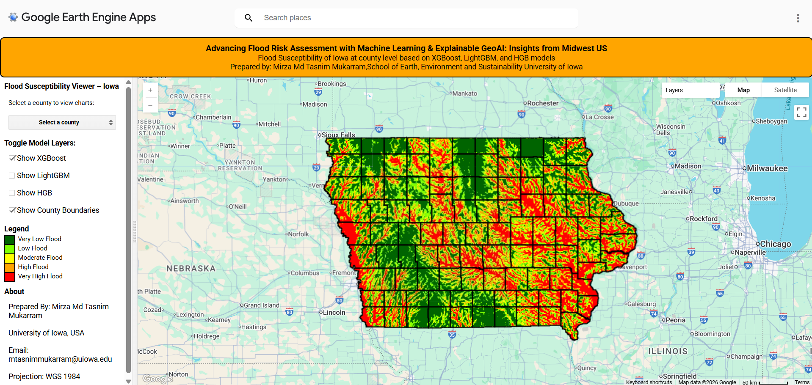

# 🌊 Flood Susceptibility Mapping in Iowa using GeoAI

🔗 **Live GEE App:**  
https://phduiowa.users.earthengine.app/view/machine-learning-based-flood-map-for-iowa

---

## 🗺️ Interactive Viewer

---

## 🎥 Live Application Demo

<video width="900" controls>
  <source src="FSM_MMTM_IA_Final.mp4" type="video/mp4">
  Your browser does not support the video tag.
</video>

---

## 📌 Overview

This repository presents a machine-learning-driven flood susceptibility mapping framework
for the state of Iowa using ensemble gradient boosting models and explainable GeoAI.
The system integrates multi-source geospatial datasets and provides an interactive
Google Earth Engine application for visualization and decision support.

---

## ⚙️ Key Capabilities

- Ensemble ML models: XGBoost, LightGBM, Histogram GBM  
- 30 m resolution statewide flood susceptibility mapping  
- County-level interactive analytics  
- Explainable AI interpretation  
- Cloud-native deployment using Google Earth Engine  
- Open-access visualization  

---

## 👤 Author

**Mirza Md Tasnim Mukarram**  
PhD Researcher  
School of Earth, Environment and Sustainability  
University of Iowa  
Email: mtasnimmukarram@uiowa.edu

---

## 📜 License

MIT License
# Flood-Hazard-Mapping-
GEE App: https://phduiowa.users.earthengine.app/view/machine-learning-based-flood-map-for-iowa 
